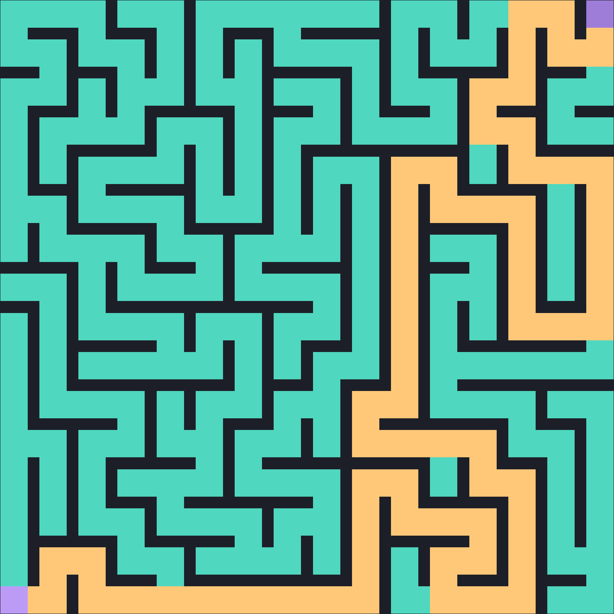
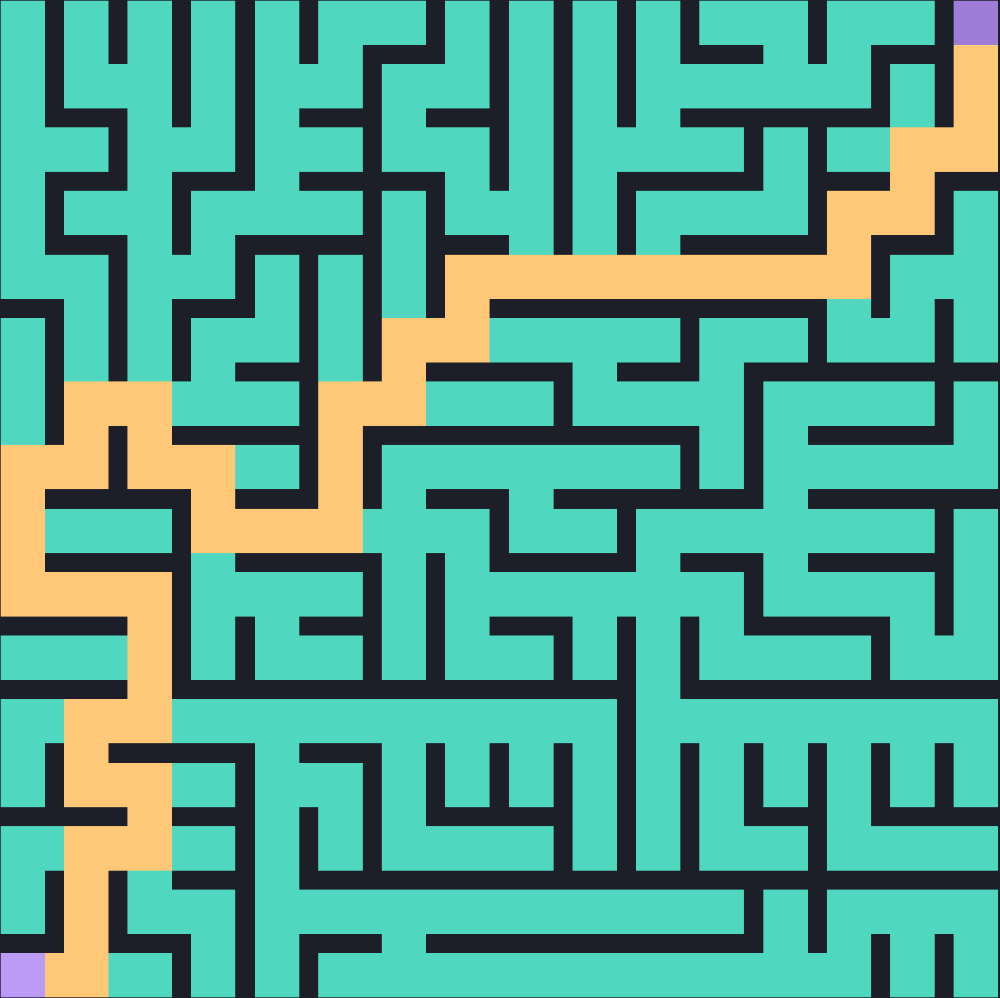
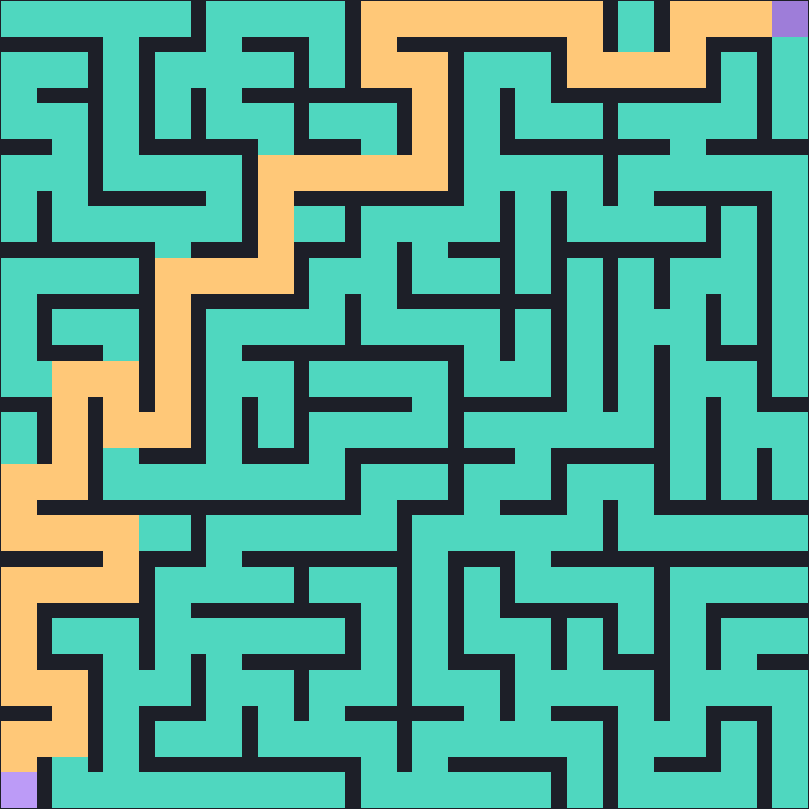
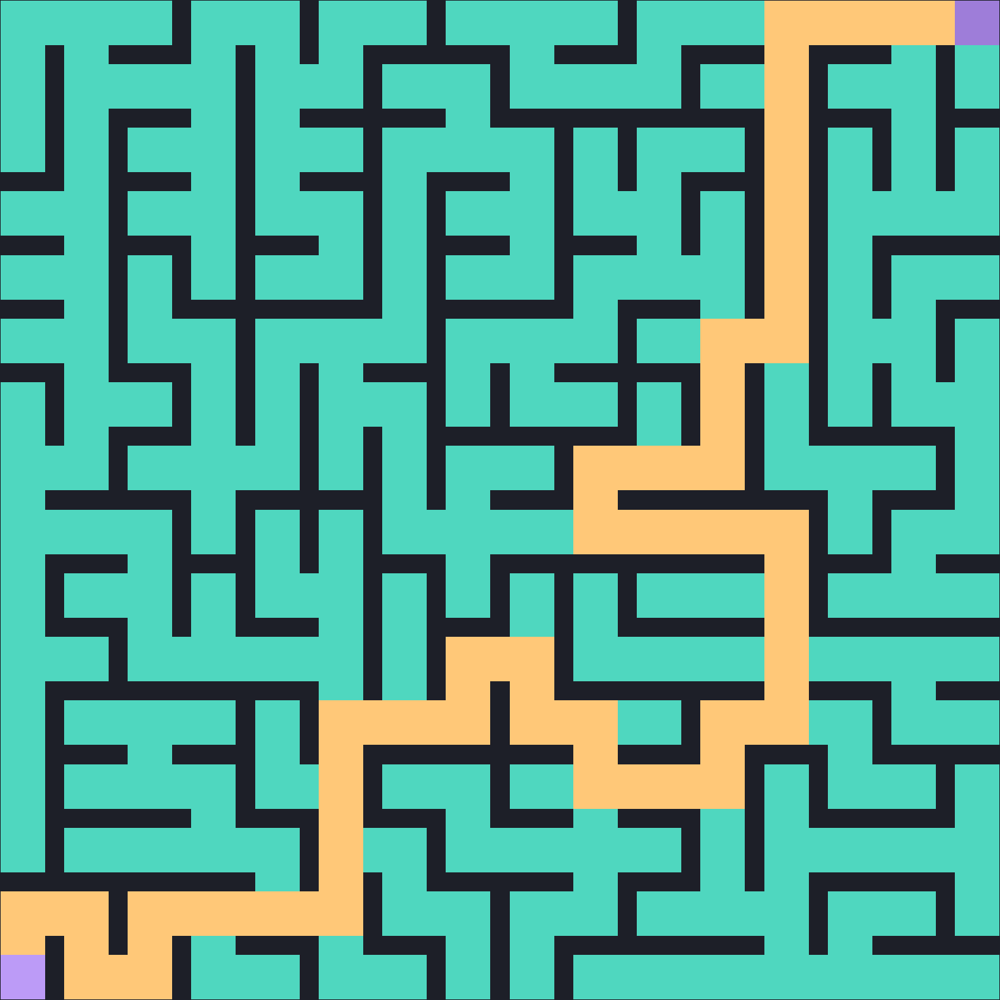
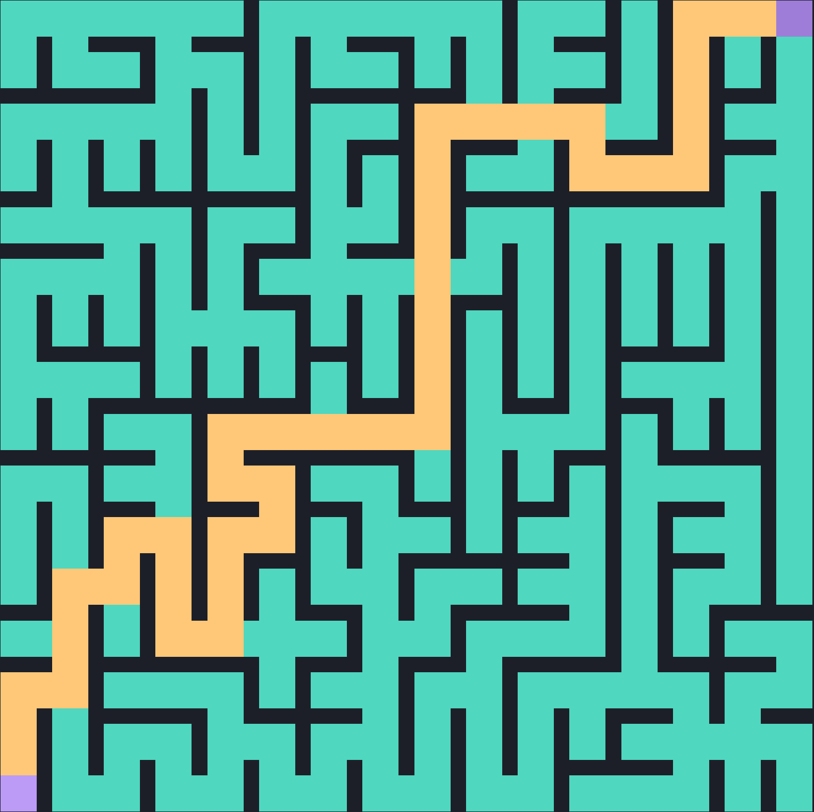
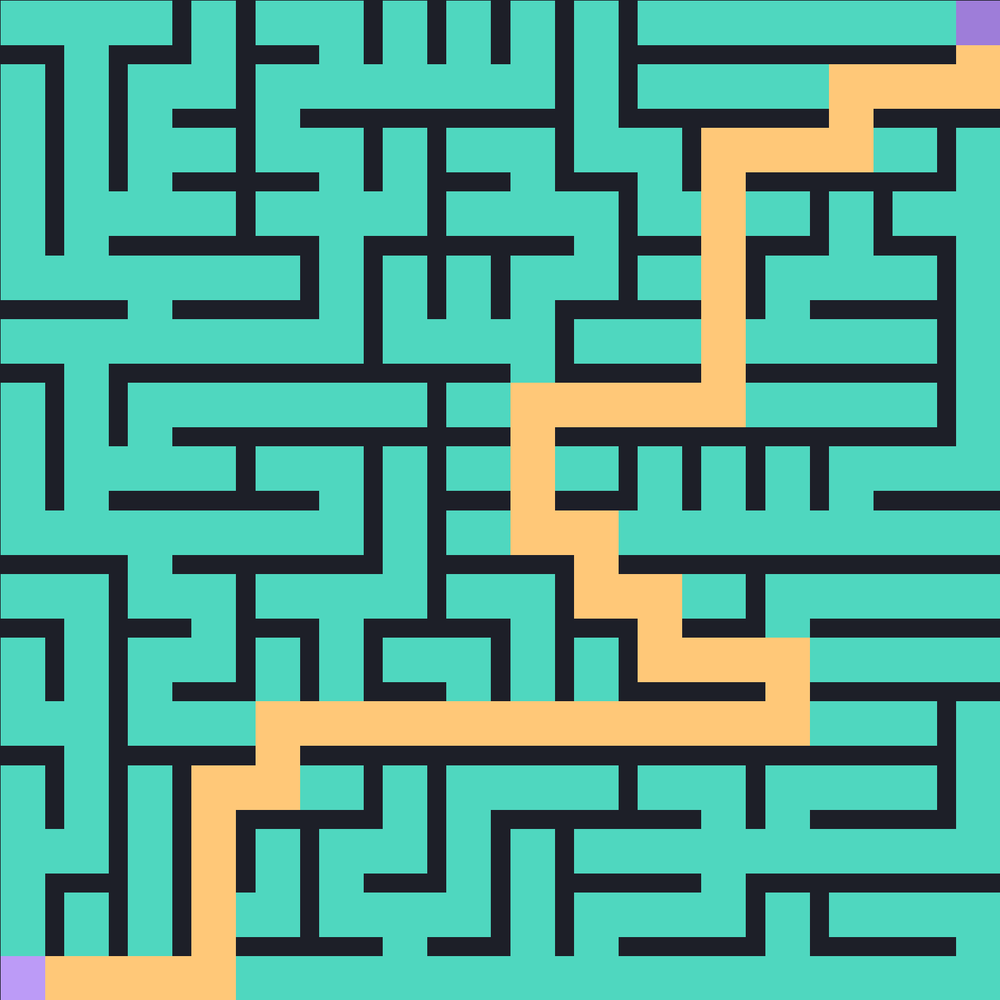
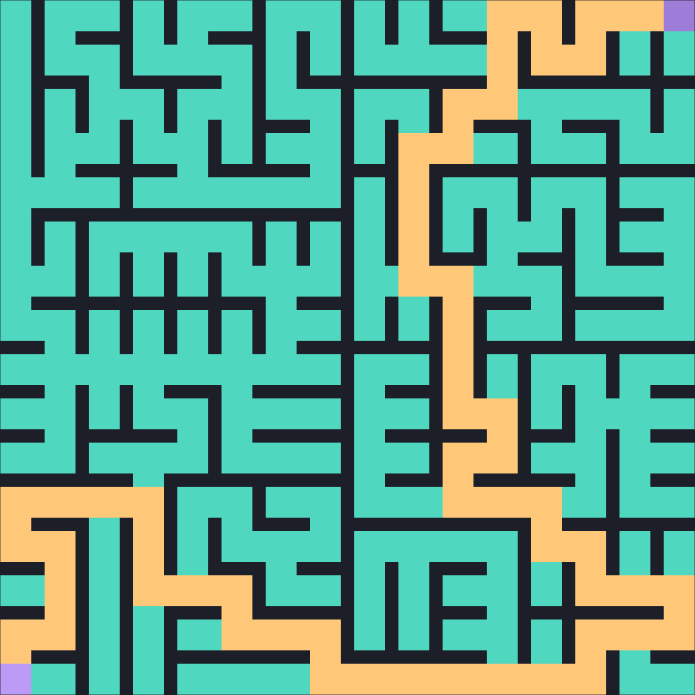

# Maze Algorithms

## Description

A collection of maze algorithms built in Rust, with the ability to view maze generation progress in an interactive window.

## Algorithms

### Depth First Search

### Prim's Algorithm

### Growing Tree Algorithm

### Kruskal's Algorithm

### Eller's Algorithm

### Sidewinder

### Recursive Division

## Credits

- ["Maze Generation Algorithms - An Exploration"](https://professor-l.github.io/mazes/)
- [Jamis Buck "Maze Generation"](https://weblog.jamisbuck.org/2011/2/7/maze-generation-algorithm-recap)
